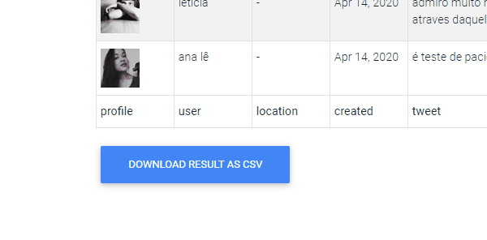

# Full-stack Mockup for Twitter API

Web application for extracting tweets through Twitter API.

#### Requirements to this Project

- Extract tweets according to user input,
- Pagination by web interface,
- Statistics from Twitter API extraction,
- Result exportation to CSV file,
- Ready to use with Docker.

| Tweet search and Statistics |      |
| --------------------------- | ------------------------------------ |
| **Pagination**              |  |
| **Export to CSV file**      |    |

# 	How to run

Requirement: NodeJS (v12.16.1, more info: https:/nodejs.org)

## 	Running by Node.js

Steps to run the project locally:

- Download the project from (https://github.com/RogerRocco/reactjs-expressjs-node-twitterAPI/archive/master.zip)

- Unzip the project locally and go into it,

- Using your Terminal/CMD, inside the **back-end** directory and run: `node index.js`

- Using your Terminal/CMD, inside **front-end** directory and run: `npm start`

- Access the local web host (http://localhost) on your web browser.

  
  
## 	Running by Docker

This repository includes two Dockerfiles properly configured, one to frontend and another to backend.

To start, generate the docker images and then run as the instructions below:

- run the backend: ` docker run -it -d <REPOSITORY_NAME:BACKEND_IMG_TAG>`

- run the frontend: `docker run -it -d -p 80:3000 <REPOSITORY_NAME:BACKEND_IMG_TAG>`

- finally, access the application by the address http://localhost

  

# 	Concepts included on the project

#### ReactJS concepts implemented in the project

state and props lifecycle, multiple component levels, custom port usage, force Update, component, data transaction between components and siblings.

#### JS features implemented

Date formatting, port customization for the front and back-end, loops, arrays, ternary operator.

#### Other concepts

Rest API, OOP, a short usage of encapsulation and SOLID.
